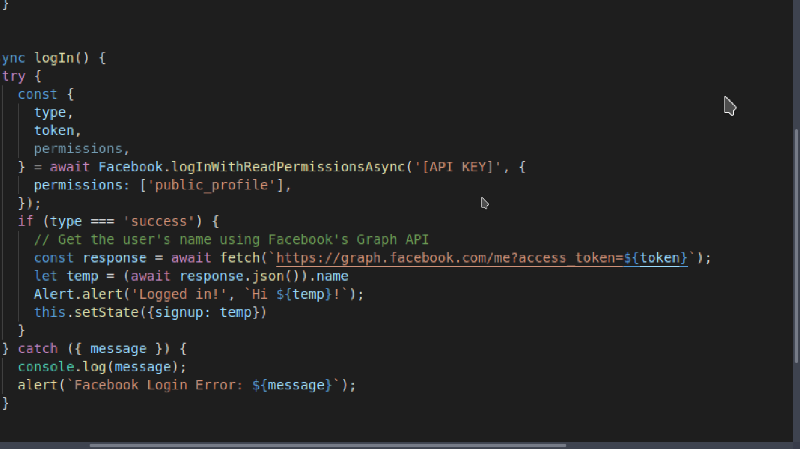

# Install
- Instal expo cli : npm install expo-cli
- Init project : expo init [YOUR NAME PROJECT]
- Install Facebook sdk to login Facebook : expo install expo-facebook
- Copy all files to folder project
- Go to https://developers.facebook.com/ and create api key
- Go to https://docs.expo.io/versions/v34.0.0/sdk/facebook/ to Registering your app with Facebook
- Insert your api key to :   in App.js
- Run : sudo cd [YOUR NAME PROJECT] && npm run android
- Use your phone to run or run on virtual machine