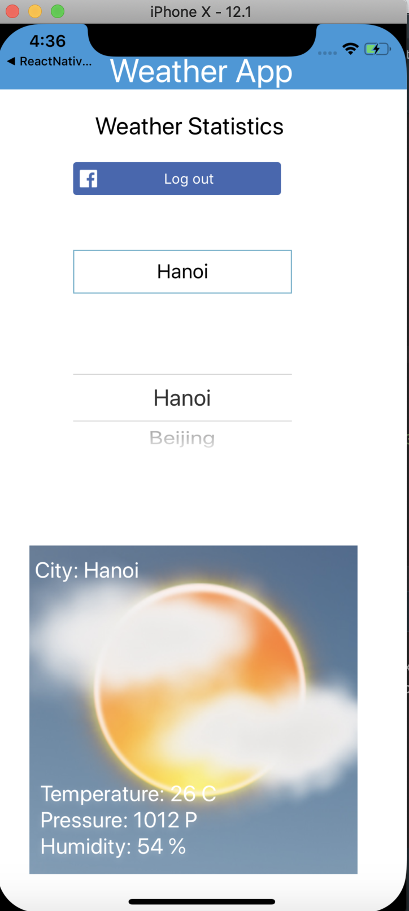
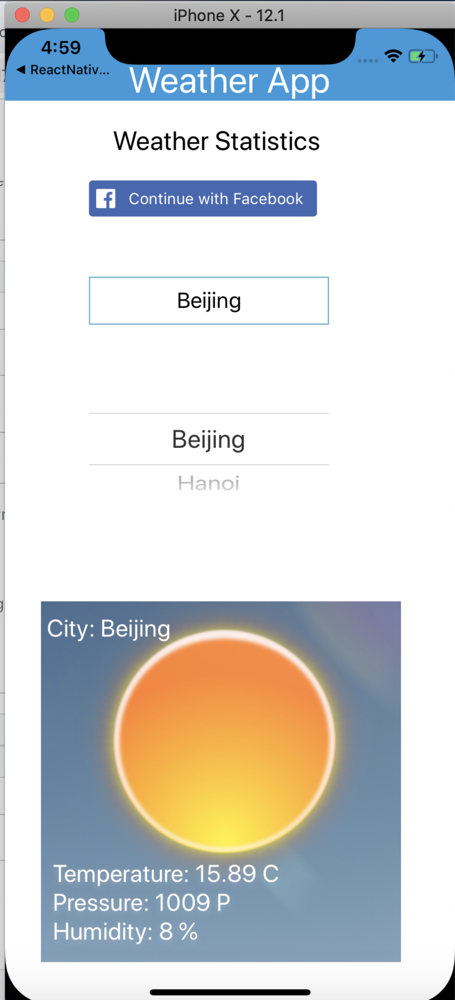
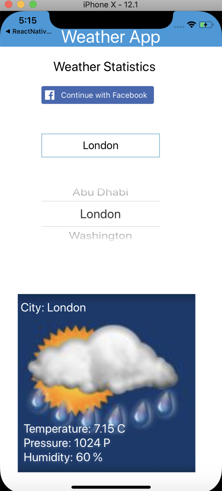

# Weather App

## Mission
You have to develop a React Native app that will work in both iOS and Android platforms. For convenience we are only going to test the app in iOS iphone simulator. Your app will query a local json file and call a third party API to fetch the data and display in the app.

## Open Weather Map API
We are going to be using a third party API to get the required data. It requires you to create an account in them and subscribe you to their api.

## How to run
- Get api key of weathermap
    
  Follow the link below to register an account.

  https://openweathermap.org

  Once you are registered you need to subscribe to Current Weather data API in the following link

  https://openweathermap.org/api

  You would have to read the API docs for the specific api. The following link helps you to understand API more

  https://openweathermap.org/current

  Replace your API key into App.js

- Get api key of facebook to use login feature
  
  Please follow : https://docs.expo.io/versions/latest/sdk/facebook/

- Run
  
  $npm install
  
  $npm start
  
  Scan QR with your phone

## The App

